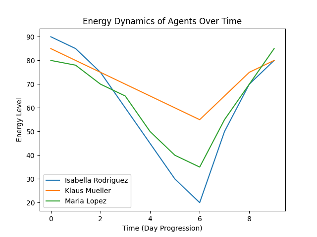
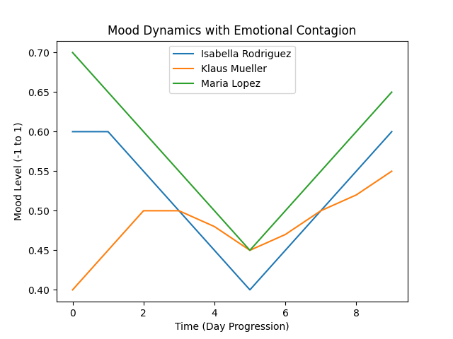

# 🚀 Enhancing Generative Agents with Mood, Emotional Contagion, and Energy Systems

## 📌 Overview

This project extends the original **Generative Agents architecture** by introducing three major systems that improve realism and behavioral depth:

* 🧠 **Mood System**
* 🤝 **Emotional Contagion System**
* ⚡ **Energy System**

These additions make agents behave more like real humans by incorporating:

* Emotional state
* Social influence
* Physical limitations

---

## 🧠 1. Mood System

### 🔹 Description

Each agent maintains a **continuous mood value** in the range **[-1, 1]**.

### 🔹 Features

* Mood baseline derived from personality traits
* Event-driven updates
* Natural drift toward baseline
* Mood labeling (happy, neutral, sad)

### 🔹 Impact

* Influences decision-making
* Affects reflection behavior
* Impacts energy initialization

---

## 🤝 2. Emotional Contagion System

### 🔹 Description

Agents influence each other’s emotions during interactions.

### 🔹 Mechanism

* Bidirectional mood updates during conversations
* Controlled via contagion rate
* Values clamped to maintain stability

### 🔹 Outcome

* Social emotional alignment
* Emergent group behavior
* Realistic interaction dynamics

---

## ⚡ 3. Energy System

### 🔹 Description

Agents now have **finite energy**, introducing physical constraints.

### 🔹 Energy Initialization

[
E = 0.125 \times (\text{sleep hours}) \times 100 \times (1 + 0.5 \times \text{mood})
]

### 🔹 Energy Consumption

* Walking → 0.1 per step
* Working → 10 per hour
* Talking → 8 per hour

### 🔹 Recovery

* Eating restores energy
* Resting gradually replenishes energy

### 🔹 Override Behavior

If energy < 15:

* Agent stops current task
* Returns home
* Takes a 2-hour rest
* Energy resets to baseline

---

## 🔄 System Interaction Flow

1. **Wake-up Phase** → Energy initialized using sleep + mood
2. **Action Execution** → Energy consumed
3. **Social Interaction** → Mood updated via contagion
4. **Feedback Loop** → Mood influences future actions and energy
5. **Low-Energy Override** → Forced rest triggered

---

## 📊 Results & Observations

### ⚡ Energy Dynamics

**Insights:**

* Isabella shows rapid energy depletion due to continuous work
* Klaus maintains stable energy due to a balanced routine
* Maria exhibits fluctuating energy patterns due to irregular activity

---

### 🧠 Mood Dynamics with Emotional Contagion

**Insights:**

* Agents’ moods converge during interactions
* Emotional contagion creates synchronization
* Individual personality causes slight divergence over time

---

## 🧪 Ablation Insights

| System Removed | Result                          |
| -------------- | ------------------------------- |
| Mood           | Deterministic behavior          |
| Contagion      | No emotional spread             |
| Energy         | Unrealistic continuous activity |

---

## 🏗️ Architecture Design

* Modular design using:

  * `MoodManager`
  * `EnergyManager`
  * `EmotionContagion`
* Integrated via `Scratch` (central state)
* Backward-compatible with existing modules

---

## 🎯 Key Contributions

* Introduced **affective + physiological modeling** into agents
* Enabled **emotion-driven and energy-constrained decision making**
* Demonstrated **emergent behavior** through social interaction
* Maintained **modular and scalable architecture**

---

## 📂 Repository

🔗 GitHub:
https://github.com/Dontcryx07/AI111_Final_Submission

---

## 🏁 Conclusion

By integrating mood, emotional contagion, and energy systems, this work significantly enhances the realism of generative agents. Agents now exhibit:

* Emotion-aware decisions
* Socially influenced behavior
* Physically constrained activity

This creates a more **human-like, dynamic, and believable simulation environment**.

---
